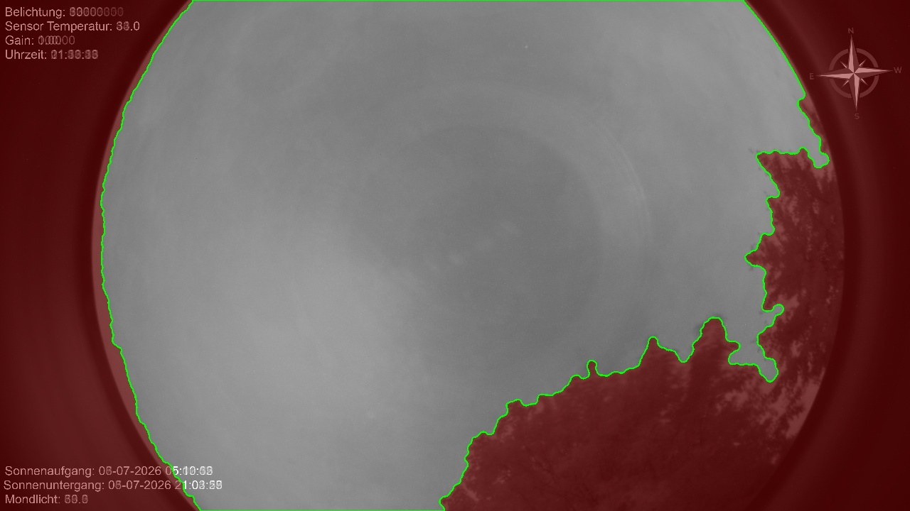

# allsky_meteordetect

A **temporal meteor detection** module for [Allsky](https://github.com/AllskyTeam/allsky).

Unlike single-frame streak detectors, this module tells meteors apart from
aircraft and satellites — the thing single-frame detectors fundamentally cannot do.



*Detection mask built by `tools/build_mask.py`: green = usable sky, red = ignored
(trees, horizon, lens vignette).*

## Why another meteor module?

The detector bundled with Allsky — and the one in indi-allsky — look for straight
lines in a **single image** (Canny → Hough). That approach cannot distinguish a
meteor from an aircraft, a satellite, a cloud edge or a power line, because in one
frame they all look like a bright streak. The result is either constant false
alarms or a threshold so high that real meteors are missed.

The physical thing that makes a meteor a meteor is **transience**: it is present in
*one* frame. A satellite or aircraft moves across *several consecutive* frames.
This module uses that.

## How it works

```
frame N-1, frame N ─► difference ─► threshold ─► soft mask
      └► connected components + PCA ─► streaks (length + elongation)
            │
            ▼  classify against neighbouring frames
   streak continues a PROGRESSING track   →  satellite / aircraft   (rejected)
   streak repeats at the SAME location     →  disappearance of a meteor (de-duped)
   isolated, transient streak              →  meteor candidate → confirmed next frame → saved
```

Key points:

- **Frame differencing** removes stars and static clouds, so — unlike single-frame
  detection — the sky background does not generate lines.
- **PCA streaks** (connected components + principal-axis length/elongation) are
  robust against gaps and reject blobby cloud brightening.
- **Deferred confirmation:** a candidate is held for one frame and only saved if
  the next frame shows no progressing continuation — so a satellite is rejected
  even on its *first* appearance (a live detector has no future frames).
- **Soft, feathered mask edge** (a trick borrowed from indi-allsky) so the mask
  boundary itself is never detected as a streak.
- **Cloud and twilight gates** skip frames that are too bright or changing too much.

## Requirements

- Allsky `v2023.05.01_04` or later (module system).
- Python packages already present in the Allsky virtualenv: `opencv-python`, `numpy`.

## Installation

Copy the module into your Allsky modules folder:

```bash
cp allsky_meteordetect.py ~/allsky/scripts/modules/
```

or drop it into a clone of
[allsky-modules](https://github.com/AllskyTeam/allsky-modules) and run its
installer. Then enable **“Meteor Detection (temporal)”** in the Allsky WebUI under
*Module Settings* for the **night** flow.

## Building a detection mask

Trees, buildings and the lens vignette should be excluded, or wind-blown leaves
produce endless false positives. `tools/build_mask.py` builds the mask
automatically from your own daytime images:

```bash
python3 tools/build_mask.py \
    --images ~/allsky/images \
    --nights 20260703 20260704 20260705 \
    --out meteor_mask.png \
    --preview preview.jpg
```

Copy `meteor_mask.png` into `~/allsky/config/overlay/images/` and select it as the
module's **Detection Mask**.

**Method.** Obstructions are *persistently dark silhouettes*. For every pixel the
tool measures, across many daytime frames, how often it is markedly darker than the
sky (referenced to the bright image centre). Sky is rarely dark, trees almost
always are — a far more robust separator than brightness or texture, both of which
fail because tree interiors are smooth and averaging washes out their texture.

## Configuration

| Setting | Default | Meaning |
|---|---|---|
| Detection Mask | `meteor_mask.png` | White = sky to analyse, black = ignore |
| Min Streak Length | `40` px | Minimum streak length — the main lever against short star artifacts |
| Difference Threshold | `22` | Brightness increase over previous frame to count as “new” |
| Min Elongation | `4.0` | Length/width ratio (rejects round star blobs and clouds) |
| Max Streak Area | `6000` px | Larger regions = cloud brightening |
| Cloud Skip | `2.0` % | Skip frame if more than this share of sky changed |
| Mask Edge Feather | `35` px | Soft mask fade so the edge is not detected |
| Reject Satellites/Aircraft | on | Discard progressing tracks |
| Scintillation Guard | on | On very clear nights, if a frame has more than *Scintillation Max* streaks keep only a clearly dominant one |
| Scintillation Max | `8` | Streak count that marks a scintillation-dominated frame |
| Upload to Remote Website | on | Upload each hit via Allsky's `upload.sh` |
| Save Marked Copy | off | Extra copy with brackets *around* the streak |

**Clear nights are the hard case.** Star scintillation and slight frame shake make
bright stars flicker into short streaks that share a meteor's appear-then-disappear
signature. The defenses are, in order of impact: geometry (a real meteor is long and
thin — raise *Min Streak Length* / *Min Elongation* if a clear night still produces
false positives), the scintillation guard, and same-location confirmation. There is
no single perfect filter; tune the geometry to your sky.

## Fisheye calibration & geometric radiant matching (optional)

With a calibrated fisheye projection the module can attribute each meteor to the
**shower whose radiant its streak actually points back to** — real geometry, not
just "which showers are active tonight".

`tools/calibrate_fisheye.py` fits the camera model (optical centre, radial
distortion, rotation, handedness) from a plate-solved night frame: bright stars are
detected, their true alt/az computed (Hipparcos + sidereal time), matched and
least-squares fitted. Blind matching is unreliable on a rich Milky-Way sky, so the
robust path is to **plate-solve a small zenith crop with astrometry.net** (which is
robust to star density) and bootstrap the full-frame fit from it. The result is a
`calibration.json` (verified here to **0.11° RMS over 228 stars**).

`allsky_fisheye.py` then provides `pixel_to_altaz` / `altaz_to_pixel` and
`match_radiant`: a meteor travels along a great circle whose backward extension
passes through its radiant, so the module tests which active shower's radiant lies
on that circle (and above the horizon).

Drop `allsky_fisheye.py` + `calibration.json` next to the module; if either is
missing, radiant matching is silently skipped. **The calibration is per-camera** —
regenerate it for your own site with `tools/calibrate_fisheye.py`.

## Output

- **`meteors-<timestamp>.jpg`** in the website `meteors/` folder, plus a thumbnail
  in `meteors/thumbnails/` — picked up automatically by Allsky's meteor gallery
  page. **The gallery image keeps the meteor's true colours, untouched.**
- **`meteors.json`** — a rolling log of
  `{time, file, length, angle, elong, peak, showers, radiant}` for later statistics
  (`showers` = active by date, `radiant` = geometric attribution if calibrated).
- Optional remote-website upload of each hit.

### Why true colour matters

Meteor colour encodes composition — green from magnesium/oxygen, yellow/orange from
sodium/iron, blue-white for fast trails. The gallery image is therefore never
painted over; the optional marked copy draws brackets *around* the streak, never on
it.

## Roadmap

- [ ] **Keogram markers** for detected meteors.
- [ ] **Sky Quality Meter (SQM)** in mag/arcsec², following indi-allsky:
      `mag = offset − 2.5·log10(mean_ADU)` over a masked ROI (offset calibrated
      against a real SQM device).
- [ ] **Time-series dashboard charts** (SQM, star count, temperature) in the style
      of indi-allsky's `webui_chart01`, fed from a rolling `chart.json` and drawn
      with Chart.js — no backend required.
- [x] Meteor-shower radiant awareness (Perseids, Geminids, …) — date-based context
      **and** geometric radiant matching via a plate-solved fisheye calibration.
- [ ] Optional pull request to `AllskyTeam/allsky-modules`.

## Credits & inspiration

- [Allsky](https://github.com/AllskyTeam/allsky) by Thomas Jacquin and the Allsky team.
- [indi-allsky](https://github.com/aaronwmorris/indi-allsky) by Aaron Morris — the
  feathered-mask trick and the SQM/chart approach on the roadmap are inspired by it.
- Built for [astronomy.garden](https://astronomy.garden).

## License

MIT — see [LICENSE](LICENSE).
