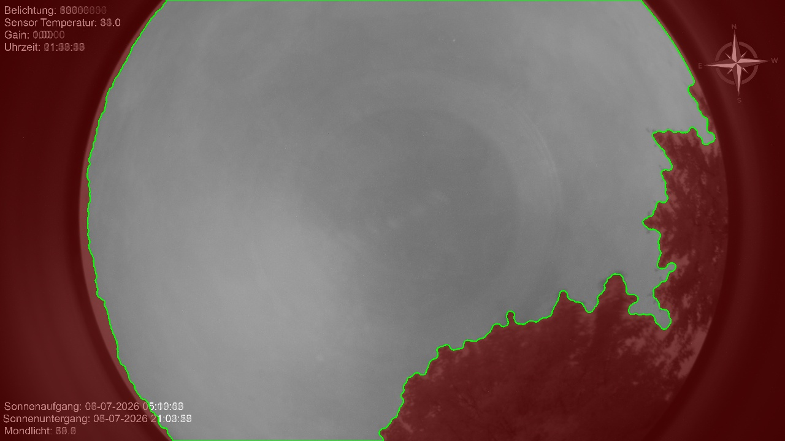

# allsky_meteordetect

A **temporal meteor detection** module for [Allsky](https://github.com/AllskyTeam/allsky).

Unlike single-frame streak detectors, this module tells meteors apart from
aircraft and satellites — the thing single-frame detectors fundamentally cannot do.



*Detection mask built by `tools/build_mask.py`: green = usable sky, red = ignored
(trees, horizon, lens vignette).*

## Why another meteor module?

The detector bundled with Allsky — and the one in indi-allsky — look for straight
lines in a **single image** (Canny → Hough). That approach cannot distinguish a
meteor from an aircraft, a satellite, a cloud edge or a power line, because in one
frame they all look like a bright streak. The result is either constant false
alarms or a threshold so high that real meteors are missed.

The physical thing that makes a meteor a meteor is **transience**: it is present in
*one* frame. A satellite or aircraft moves across *several consecutive* frames.
This module uses that.

## How it works

```
frame N-1, frame N ─► difference ─► threshold ─► soft mask
      └► connected components + PCA ─► streaks (length + elongation)
            │
            ▼  classify against neighbouring frames
   streak continues a PROGRESSING track   →  satellite / aircraft   (rejected)
   streak repeats at the SAME location     →  disappearance of a meteor (de-duped)
   isolated, transient streak              →  meteor candidate → confirmed next frame → saved
```

Key points:

- **Frame differencing** removes stars and static clouds, so — unlike single-frame
  detection — the sky background does not generate lines.
- **PCA streaks** (connected components + principal-axis length/elongation) are
  robust against gaps and reject blobby cloud brightening.
- **Deferred confirmation:** a candidate is held for one frame and only saved if
  the next frame shows no progressing continuation — so a satellite is rejected
  even on its *first* appearance (a live detector has no future frames).
- **Soft, feathered mask edge** (a trick borrowed from indi-allsky) so the mask
  boundary itself is never detected as a streak.
- **Cloud and twilight gates** skip frames that are too bright or changing too much.

## Requirements

- Allsky `v2023.05.01_04` or later — that is the module API this needs, **not** a
  release that ships it. This is a third-party module: it is not bundled with Allsky
  or the official [allsky-modules](https://github.com/AllskyTeam/allsky-modules)
  collection, so no installer dialog in the WebUI will offer it — you copy it in by
  hand (below).
- Tested on Allsky `v2024.12.06_06`. Not yet run on the 2025 branch, though the
  2025 Module Manager's metadata parser has been checked against this module. If
  something does not work there, please
  [open an issue](https://github.com/benhartwich/allsky-meteordetect/issues).
- Python packages already present in the Allsky virtualenv: `opencv-python`, `numpy`.

## Installation

> **Not in the Module *package* Manager.** That dialog installs from the official
> [allsky-modules](https://github.com/AllskyTeam/allsky-modules) collection, and this
> module is not part of it — filtering there for “meteor” will always come up empty.
> Copy the file in by hand instead, then add it to a flow.

**1. Copy the module in.** Where it goes depends on your Allsky version:

```bash
# Allsky 2025 and later - the folder for your own modules, searched first
mkdir -p ~/allsky/config/myFiles/modules
cp allsky_meteordetect.py ~/allsky/config/myFiles/modules/

# Allsky 2024 and earlier - that folder does not exist yet
cp allsky_meteordetect.py ~/allsky/scripts/modules/
```

On 2025 both locations work, but `scripts/modules/` is Allsky's own folder and an
upgrade may overwrite what you put there; `config/myFiles/modules/` is yours and takes
precedence. You can also drop the file into a clone of
[allsky-modules](https://github.com/AllskyTeam/allsky-modules) and run its installer.

**2. Add it to the night flow.** Open the Module Manager in the WebUI and switch to the
**night** flow — the module declares `"events": ["night"]`, so it deliberately does not
appear under day. **“Meteor Detection (temporal)”** is then in the list of available modules.
Allsky's own single-frame module is called plain *“Meteor Detection”* — that is not this
one. Running both is possible but redundant; if you do, keep this one directly after
*Load Image* so the other's debug annotations never end up in the saved meteor images.

**3. Put it directly after *Load Image*.** The module saves the frame as it stands at its
position in the flow, so anything running before it — the overlay, for instance — ends
up in the saved meteor images.

## Building a detection mask

Trees, buildings and the lens vignette should be excluded, or wind-blown leaves
produce endless false positives. `tools/build_mask.py` builds the mask
automatically from your own daytime images:

```bash
python3 tools/build_mask.py \
    --images ~/allsky/images \
    --nights 20260703 20260704 20260705 \
    --out meteor_mask.png \
    --preview preview.jpg
```

Copy `meteor_mask.png` into `~/allsky/config/overlay/images/` and select it as the
module's **Detection Mask**.

**Method.** Obstructions are *persistently dark silhouettes*. For every pixel the
tool measures, across many daytime frames, how often it is markedly darker than the
sky (referenced to the bright image centre). Sky is rarely dark, trees almost
always are — a far more robust separator than brightness or texture, both of which
fail because tree interiors are smooth and averaging washes out their texture.

## Configuration

| Setting | Default | Meaning |
|---|---|---|
| Detection Mask | `meteor_mask.png` | White = sky to analyse, black = ignore |
| Min Streak Length | `50` px | Minimum streak length — the main lever against short star artifacts |
| Difference Threshold | `22` | Brightness increase over previous frame to count as “new” |
| Min Elongation | `5.0` | Length/width ratio (rejects round star blobs and clouds); real meteors here measured ≥7 |
| Max Streak Area | `6000` px | Larger regions = cloud brightening |
| Cloud Skip | `2.0` % | Skip frame if more than this share of sky changed |
| Mask Edge Feather | `35` px | Soft mask fade so the edge is not detected |
| Reject Dashed Trails | on | Reject a long streak broken into many bright/dark segments — a tumbling satellite or strobing aircraft |
| Dash Segments | `10` | Segment count that marks a streak as dashed (real meteor ≤5, a dashed satellite scored 19) |
| Dash Min Length | `120` px | Only test streaks at least this long for a dashed pattern; short meteors are exempt |
| Reject Fragmented Trails (arm) | off | Arm the fragmented-trail veto. **Off = shadow mode**: the collinear-fragment metric is measured and logged (`frag_n`/`frag_ext`, `frag-shadow`) but nothing is vetoed. Turn on only after real meteors confirm they score 0 |
| Fragment Segments | `3` | Collinear diff fragments beyond a streak's ends that mark it as the head of a fragmented dashed trail (real meteor 0, validated glint 3) |
| Fragment Min Length | `120` px | Only test streaks at least this long for a collinear fragmented tail |
| Reject Satellites/Aircraft | on | Discard progressing tracks |
| Scintillation Guard | on | On very clear nights, if a frame has more than *Scintillation Max* streaks keep only a clearly dominant one |
| Scintillation Max | `8` | Streak count that marks a scintillation-dominated frame |
| Reject Recurring Positions | on | Reject a spot that keeps firing across frames (scintillation/bloom/trailed star/reflection); a real meteor appears once |
| Recurrence Frames | `3` | Earlier frames at the same spot (~55 px, ~25 min) needed to call it recurring — keep ≥3 |
| Reject Star-Trail Orientation | on | Reject a streak parallel to the local diurnal star-trail direction (needs the fisheye calibration); fireballs >130 px exempt |
| Star-Trail Tolerance | `12`° | How close to the trail direction counts as a trailed star |
| Reject Bright-Star Scintillation | on | Reject a short streak sitting on a catalogue bright star — a star twinkling brighter between frames makes a compact diff blob at its position that mimics a meteor. Needs the fisheye calibration + `stars.json`; fireballs >130 px exempt |
| Star-Match Radius | `16` px | How close a streak's centre must be to a projected catalogue star to count as that star. Size it to the calibration RMS (~4–6 px) plus a few px of blob offset |
| Star Magnitude Limit | `5.0` | Only stars brighter than this are used; fainter stars rarely brighten enough to trigger, and including them risks vetoing a real meteor |
| Upload to Remote Website | on | Upload each hit via Allsky's `upload.sh` |
| Save Rejected-Candidate Crops | on | Save a labelling crop of every *rejected* streak (into `vetoed/`) as the negative examples for a future classifier — see below |
| Browse in the Allsky WebUI | on | Also file each meteor under `images/<day>/meteors/` so the WebUI's **Meteors** page can browse it day by day — see [Output](#output) |
| Save Marked Copy | on | Extra copy with brackets *around* the streak, plus its thumbnail (the WebUI's *Use Marked Meteors* option needs both) |

**Clear nights are the hard case.** Star scintillation and slight frame shake make
bright stars flicker into short streaks that share a meteor's appear-then-disappear
signature. The defenses are, in order of impact: geometry (a real meteor is long and
thin — raise *Min Streak Length* / *Min Elongation* if a clear night still produces
false positives), the scintillation guard, and same-location confirmation. There is
no single perfect filter; tune the geometry to your sky. With a fisheye
calibration, the **bright-star scintillation veto** adds a targeted defense: it
rejects a short blob that sits exactly on a catalogue bright star, which is what a
twinkling star produces — geometry alone can't tell that blob from a faint short
meteor, but its position on a known star can.

## Fisheye calibration & geometric radiant matching (optional)

With a calibrated fisheye projection the module can attribute each meteor to the
**shower whose radiant its streak actually points back to** — real geometry, not
just "which showers are active tonight".

`tools/calibrate_fisheye.py` fits the camera model (optical centre, radial
distortion, rotation, handedness) from a plate-solved night frame: bright stars are
detected, their true alt/az computed (Hipparcos + sidereal time), matched and
least-squares fitted. Blind matching is unreliable on a rich Milky-Way sky, so the
robust path is to **plate-solve a small zenith crop with astrometry.net** (which is
robust to star density) and bootstrap the full-frame fit from it. The result is a
`calibration.json` (verified here to **0.11° RMS over 228 stars**).

`allsky_fisheye.py` then provides `pixel_to_altaz` / `altaz_to_pixel` and
`match_radiant`: a meteor travels along a great circle whose backward extension
passes through its radiant, so the module tests which active shower's radiant lies
on that circle (and above the horizon).

The same projection also drives the **bright-star scintillation veto**: a bundled
Hipparcos subset (`stars.json`, Vmag < 6) is projected to pixels for each frame's
time, and a short candidate that lands within *Star-Match Radius* of a catalogue
star brighter than *Star Magnitude Limit* is rejected as a twinkling star rather
than a meteor. It needs `stars.json` next to the module; if it (or the calibration)
is missing, the veto is silently skipped. **Accuracy matters:** size the radius to
your calibration RMS — regenerate `calibration.json` if bright stars drift off their
catalogue positions, or the veto will either miss scintillation or clip real meteors.

Drop `allsky_fisheye.py` + `calibration.json` next to the module; if either is
missing, radiant matching is silently skipped. **The calibration is per-camera** —
regenerate it for your own site with `tools/calibrate_fisheye.py`.

## Output

Each hit is written to **two** places, because the website and the WebUI want
different layouts.

**Website folder** (`meteors/`, the source for the remote upload and the per-night
charts):

- **`meteors-<timestamp>.jpg`**, plus a thumbnail in `meteors/thumbnails/` —
  picked up automatically by Allsky's meteor gallery page. **The gallery image keeps
  the meteor's true colours, untouched.**
- **`meteors-<timestamp>-marked.jpg`** and its thumbnail, when *Save Marked Copy*
  is on.
- **`meteors.json`** — a rolling log of
  `{time, file, length, angle, elong, peak, frag_n, frag_ext, showers, radiant}`
  for later statistics (`showers` = active by date, `radiant` = geometric
  attribution if calibrated, `frag_n` = collinear-fragment shadow metric).
- Optional remote-website upload of each hit.

**Allsky WebUI folder** (under `images/<day>/`, when *Browse in the Allsky WebUI*
is on) — the layout the WebUI's **Meteors** page reads:

```
images/<day>/meteors/meteors-<timestamp>.jpg
images/<day>/meteors/meteors-<timestamp>-marked.jpg     (Save Marked Copy)
images/<day>/meteors/meteors-<timestamp>.json
images/<day>/meteorsthumbnails/meteors-<timestamp>.jpg
images/<day>/meteorsthumbnails/meteors-<timestamp>-marked.jpg
```

- **`meteors-<timestamp>.json`** — a sidecar holding *only that image's* streaks
  (same fields as the rolling log). The WebUI reads one file per image rather than
  scanning a rolling log, so the sidecar exists alongside it, not instead of it.
- **Thumbnails sit in the sibling `meteorsthumbnails/`**, not in a `thumbnails/`
  subfolder of `meteors/` — that is where the WebUI's Meteors page reads them. The
  website folder above keeps its own `meteors/thumbnails/`, which its gallery page
  expects.

The day folder follows Allsky's own convention: it is the night's *evening* date
(`DATE_NAME`, 12-hour offset), while the file name carries the real timestamp. A
meteor at 03:15 on the 19th therefore lands in `images/20260918/` as
`meteors-20260919031514.jpg` — exactly like Allsky's own `image-*.jpg` files.

### Backfilling meteors detected before v0.5.0

Older detections only exist flat in the website folder, so the WebUI page stays
empty until the next meteor. `tools/backfill_webui.py` files them into the day
folders once:

```bash
tools/backfill_webui.py --dry-run     # report what would happen
tools/backfill_webui.py               # do it
```

It copies out of the website folder and never modifies it, builds each sidecar
from the matching entries in the rolling `meteors.json`, and **redraws** the
marked copy from the logged `p1`/`p2` endpoints — pre-v0.5.0 the marked copy was
off by default, so for most historical meteors there is no file to copy. Nights
whose images were long since purged get their day folder recreated holding only
meteors; pass `--existing-days-only` to skip those instead.

Run it again after upgrading from v0.5.0 or v0.5.1: those put the WebUI thumbnails
in `images/<day>/meteors/thumbnails/` and `images/<day>/meteorsthumbnail/`
respectively, and the tool moves them into `images/<day>/meteorsthumbnails/`. Add `--no-marked` if you do not want marked
copies redrawn for meteors that never had one.

Keep in mind that Allsky's *Days To Keep* setting removes whole day folders,
meteors included. The website folder follows the separate, usually much longer
*Days To Keep on Local Website*, so it stays the complete record — and the source
this tool can always refill from.

### Variables

Each frame publishes its result as Allsky variables — in the WebUI's variable list,
usable in overlays, and passed on by modules such as MQTT. The first four use **the same
names as Allsky's built-in meteor module**, so an overlay or a Home Assistant feed built
on those keeps working when you switch to this module:

| Variable | Meaning |
|---|---|
| `AS_METEORCOUNT` | meteors confirmed on this frame |
| `AS_METEORIMAGE` | file name of the meteor image saved on this frame, empty if none |
| `AS_METEORIMAGEPATH` | full path of that image under `images/<day>/meteors/` |
| `AS_METEORIMAGEURL` | WebUI URL of its thumbnail in `meteorsthumbnails/` |
| `AS_METEORMOVING` | streaks rejected as satellites/aircraft on this frame |
| `AS_METEORVETOED` | streaks rejected by the other filters on this frame |

One difference to the built-in: its image values point at the frame it analysed. Here a
meteor is only confirmed one frame later, so they point at the **saved meteor image**
instead. With *Browse in the Allsky WebUI* off, the path points into the website folder
and the URL stays empty.

Run only one of the two meteor modules: both publish `AS_METEORCOUNT`, and whichever
runs last wins.

### Why true colour matters

Meteor colour encodes composition — green from magnesium/oxygen, yellow/orange from
sodium/iron, blue-white for fast trails. The gallery image is therefore never
painted over; the optional marked copy draws brackets *around* the streak, never on
it.

## Learning a classifier from your own labels (optional)

The heuristic vetoes are good but not perfect. The module can bootstrap a *learned*
classifier from your own sky, with no extra hardware — you just confirm what each
detection actually was:

1. **Positives** are the confirmed meteors (`meteors.json` + the gallery images).
2. **Negatives** are the rejected streaks. With **Save Rejected-Candidate Crops**
   on, every veto — including the satellites/aircraft the moving-track filter
   catches — is saved as a small crop under `meteors/vetoed/` and recorded in
   `meteors_vetoed.json`.
3. **Labels** come from you: the meteor gallery page shows each confirmed meteor
   (click → the detected position is drawn *over* the image, never burnt in) and a
   *Rejected candidates* strip, each with one-tap buttons — ☄️ meteor, ✈️ aircraft,
   🛰️ satellite, ✨ artifact, ❓ unsure. A tiny `label.php` endpoint appends them to
   `labels.json`.

Then train:

```bash
# pull the labels you made online, then train
curl -s https://<your-site>/label.php -o ~/allsky/html/allsky/labels.json
python3 tools/train_classifier.py
```

`tools/train_classifier.py` (pure NumPy — no scikit-learn) assembles the geometric
features, lets **human labels override** the weak source labels, and trains a
logistic-regression meteor/not-meteor classifier with stratified k-fold
cross-validation, writing `classifier.json`. It runs immediately on the weak labels
as a baseline and **tells you honestly** when there are too few human labels to
trust — every label you add on the website makes it sharper. Use `--report` to just
see the feature distributions per class.

## Roadmap

- [ ] **Keogram markers** for detected meteors.
- [ ] **Sky Quality Meter (SQM)** in mag/arcsec², following indi-allsky:
      `mag = offset − 2.5·log10(mean_ADU)` over a masked ROI (offset calibrated
      against a real SQM device).
- [ ] **Time-series dashboard charts** (SQM, star count, temperature) in the style
      of indi-allsky's `webui_chart01`, fed from a rolling `chart.json` and drawn
      with Chart.js — no backend required.
- [x] Meteor-shower radiant awareness (Perseids, Geminids, …) — date-based context
      **and** geometric radiant matching via a plate-solved fisheye calibration.
- [x] **Learned classifier from your own labels** — website annotation of confirmed
      and rejected detections + `tools/train_classifier.py`. *(collecting labels;
      the model sharpens as they accumulate)*
- [ ] Optional pull request to `AllskyTeam/allsky-modules`.

## Credits & inspiration

- [Allsky](https://github.com/AllskyTeam/allsky) by Thomas Jacquin and the Allsky team.
- [indi-allsky](https://github.com/aaronwmorris/indi-allsky) by Aaron Morris — the
  feathered-mask trick and the SQM/chart approach on the roadmap are inspired by it.
- Built for [astronomy.garden](https://astronomy.garden).

## License

MIT — see [LICENSE](LICENSE).
